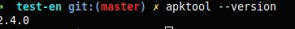

## Apktool

1)first make sure you having the apk tool 

```
apktool --version
```


2) Execute the following command

```
apktool d diva -o out

```

d - decode
o -output


3) Go into the out

```
cd out

```
4) Open the **AndroidManifest.xml**
