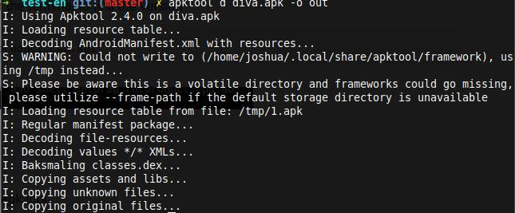
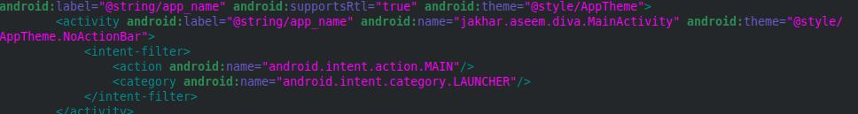
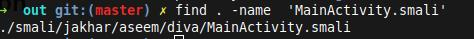

## Frida Gadget

### Finding the device architecture

Run the below command in the terminal to find the version
```
adb shell getprop ro.product.cpu.abi
```

### Reverse the app

Reverse the app using the apk tool
```
apktool d diva.apk -o out
```


### Inject the Frida-gadget


1)Download the file 

[Download-link]()

2) copy the file

3) Naviagate into the lib folder

```
cd out/lib/x86

``` 

3) Paste the **libfrida-gadget.so**

### Read the manifest

1) Open the **AndroidManifest.xml** 

Read the manifest file inside the app to find the entry point


Find the Activity with **LAUNCHER** tag



### Find Smali function


1) Find the smali for the activity
``` 
find . -name 'MainActivity.smali'

```


### Inject the smali Hook

1) navigate into the smali location

```
cd ./smali/jakhar/aseem/diva/

```

2) open the **MainActivity.smali** with the your editor
  - Increase the local 

   -Copy paste the below code

```
const-string v0, "frida-gadget"
invoke-static {v0}, Ljava/lang/System;->loadLibrary(Ljava/lang/String;)V

```

### Add the internet-permission

1) Open the **AndroidManifest.xml** 

2) Add the permiision if doesnt exist
```
<uses-permission android:name="android.permission.INTERNET" />
```

### Repackage the app

1) create the apk with the apktool
```
apktool b [folder-name] -o output.apk
```

### Signing the apk

1)Copy and save the bash scipt with **.sh** extension

``` bash
#!/bin/bash
name=$1
if [[ -n "$name" ]]; then
   zipalign -f -v 4 $name new.apk   &> obs
   apksigner sign --ks  ~/.android/debug.keystore --ks-key-alias  androiddebugkey new.apk  2>/dev/null 
else
    echo "Please enter the file name"
    exit
fi
rm obs
```

2) Make the script executable

```
chmod +x sign.sh
```
3)Run the bash script

4) Enter the password as **android**

Usage

```
./si.sh apkname
```

### Frida verification

1) Run the following comment to see the Frida -gadget   
```
frida-ps -U
```

Connect to the **Gadget**

```
frida -U Gadget

```
