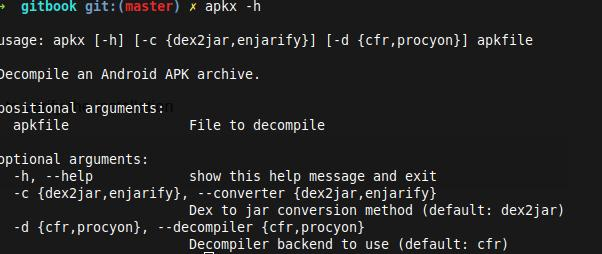

## Reversing the app

1) Clone the repo
```
git clone https://github.com/b-mueller/apkx
```
2) Move into the cloned repo
```
cd apkx
```
3)Install the app
```
sudo ./install.sh

```

## Verification

Run the following command to verify the installation
```
apkx -h
```


## Usage

```
apkx [appname]

```

> Note : If you have any  issue click the line [link](https://github.com/b-mueller/apkx/issues/3)
